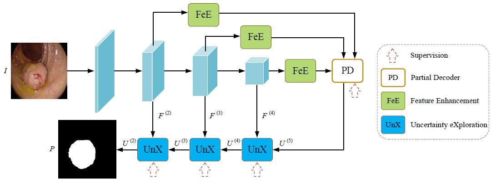
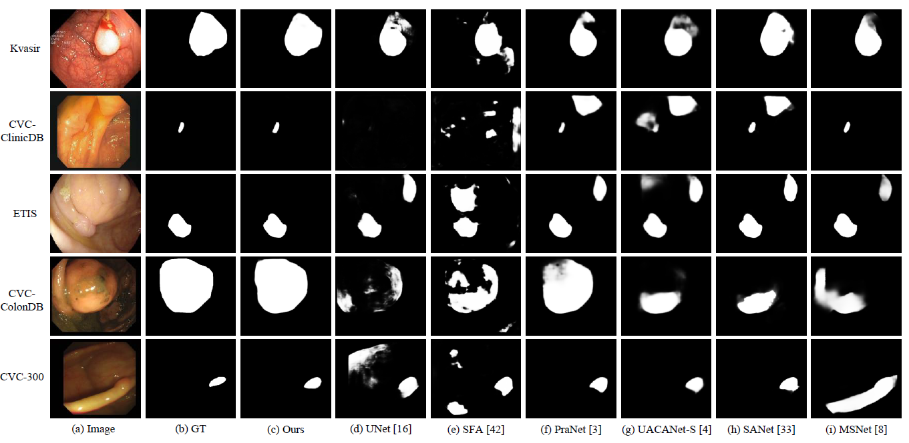

## Polyp Segmentation of Colonoscopy Images by Exploring the Uncertain Areas
This is the code repository for the paper  [Polyp Segmentation of Colonoscopy Images by Exploring the Uncertain Areas](https://ieeexplore.ieee.org/document/9775966?source=authoralert) by Qingqing Guo et al. at IEEE Access, 2022.

In this paper, we propose a new transformer encoder based polyp segmentation network. In our method, an uncertainty region based module called Uncertainty eXploration (UnX) is introduced to get the complete polyp region while eliminating the interferences from the backgrounds. Moreover, a module called Feature Enhancement (FeE) is also incorporated to enhance the discrimination for images with significant variations of sizes and shapes of polyps.

## Architecture
The UnX and FeE modules are integrated into the transformer encoder at various stages to explore the uncertain areas with enhanced multi-scale features.

## Requirements

 - Pytorch 
 - Python 
 - Numpy 
 - tqdm
 - albumentations
 - scipy
 
 ## Dataset
You can download the training dataset and the testing dataset from this link: [Dataset](https://drive.google.com/file/d/17Cs2JhKOKwt4usiAYJVJMnXfyZWySn3s/view).

## Pretrained model
You can download the pretrained model from this link: [pretrained model](https://drive.google.com/drive/folders/1Eu8v9vMRvt-dyCH0XSV2i77lAd62nPXV). And put  it in the './Pretrained models' folder for initialization. 

## Training

```
python Train.py
```

## Testing

```
python Test.py
```

## Evaluation

```
python Eval.py
```

##  Results
You can download all the segmentation maps of our methond form this link: [Segmentation Results](https://drive.google.com/file/d/1sa6qmzFN0TqnwmQGmThnq0I6If81NXQE/view?usp=sharing).
Attached below are some examples of segmentation results.



 ## Citation
 If you find this work is helpful, please cite our paper. Thanks.
 

```
@ARTICLE{9775966,
author={Guo, Qingqing and Fang, Xianyong and Wang, Linbo and Zhang, Enming},
journal={IEEE Access}, 
title={Polyp Segmentation of Colonoscopy Images by Exploring the Uncertain Areas},
year={2022},
volume={10},
pages={52971-52981},
doi={10.1109/ACCESS.2022.3175858}}
```

